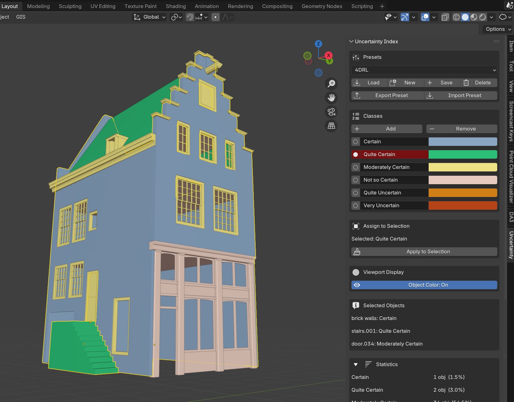

# Uncertainty Index
A Blender addon for assigning uncertainty classifications to 3D models. Aimed at heritage, archaeological, and historical visualizations where models are based on hypotheses with varying degrees of certainty.

## Blender version
This addon works with Blender 4.x

## Features
- Create custom uncertainty indices with any number of classes and associated colours.
- Load, save and delete presets.
- Includes default preset based on [ 4D Research Lab Degrees of Certainty.](https://4dresearchlab.nl/degrees-of-certainty-for-reconstructions/)
- Easily assign classes to models.
- Quickly turn on/off uncertainty visualization in the viewport.
- Basic statistics on uncertainty classes present in the model.
- Render with inclusion of legend.
- Export model names and uncertainty class to CSV.
- Stores uncertainty labels and classification as object property (saved as metdata in 3D model file using the GLTF/GLB exporter).

## AI generated
This code was developed using the claude sonnet 4.6 model.

